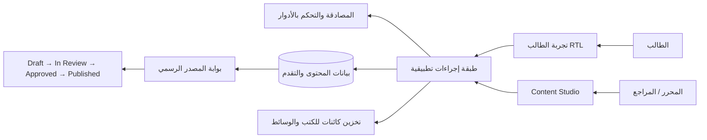

# المعمارية التقنية — رفيق الباك الذكي

## المبادئ الحاكمة

تعتمد المنصة تطبيق React وواجهة خادم TypeScript مع واجهات بيانات مكتوبة، ومصادقة مدمجة، وقاعدة بيانات علائقية. تخزّن قاعدة البيانات **البيانات الوصفية والصلاحيات وسجل المحتوى** فقط، بينما تحفظ الملفات المرفوعة والرسومات في التخزين الكائني الدائم. لا تُخزن ملفات الكتب أو الصور بصيغة BLOB داخل قاعدة البيانات.

## نطاقات البيانات

| النطاق | أمثلة للكيانات | ملاحظات حوكمة |
|---|---|---|
| المنهج | CurriculumVersion, Subject, Unit, Lesson, Concept, Skill, Prerequisite | لا ترتبط البيانات الأكاديمية إلا بإصدار منهج محدد. |
| المصادر | SourceRegistry, OfficialBookUpload, SourceVerification | المصدر الحالي فقط يمكنه دعم النشر. |
| التعلم | Slide, MindMap, Exercise, Hint, ErrorClassification | يرتبط كل عنصر بدروس ومفاهيم ومهارات. |
| التقدم | Attempt, ErrorNotebookEntry, ReviewQueueItem, MasteryRecord | ملكية الطالب ومقيّدة به. |
| التحرير | ContentWorkflow, ReviewDecision, ContentRevision | لا يوجد مسار للنشر التلقائي بالذكاء الاصطناعي. |
| الاشتراك | Plan, Entitlement, FreeUnitAccess | هيكل فقط، من دون مدفوعات في هذا الإصدار. |

## حارس النشر الأكاديمي

يتطلب الانتقال إلى `Published` تحققًا متزامنًا من: مصدر مرتبط بحالة `CURRENT_OFFICIAL`، ومطابقة السنة الدراسية والشعبة والمادة، ومراجع أكاديمي مفوّض، ومراجعة بشرية صريحة. تقارير المصدر غير المؤكد تظهر للمشرف بوضوح، ولا تُعرض كتعلم منشور للطالب.

## النسخ والإصدارات

لا تُعدّل بنية سنة دراسية قائمة عند تغيير المنهج؛ بل ينشأ سجل Curriculum Version جديد. يحتفظ كل محتوى ومصدر وتقدم بعلاقته بالإصدار المناسب، ما يسمح بإضافة 2027–2028 لاحقًا دون حذف أرشيف 2026–2027.

## النسخ الاحتياطي والاستعادة

يُصدر المحتوى المهيكل دوريًا في صيغة JSON، وتُحفظ الملفات داخل تخزين دائم مع مفاتيح كائنية. لا يُفعل أي تشغيل مجدول قبل نشر التطبيق وتهيئة نقطة معالجة آمنة وقابلة لإعادة التنفيذ. تستند الاستعادة إلى مستودع Git بعيد، ثم المخططات/الترحيلات، ثم الإعدادات، ثم استيراد المحتوى المهيكل والملفات.

